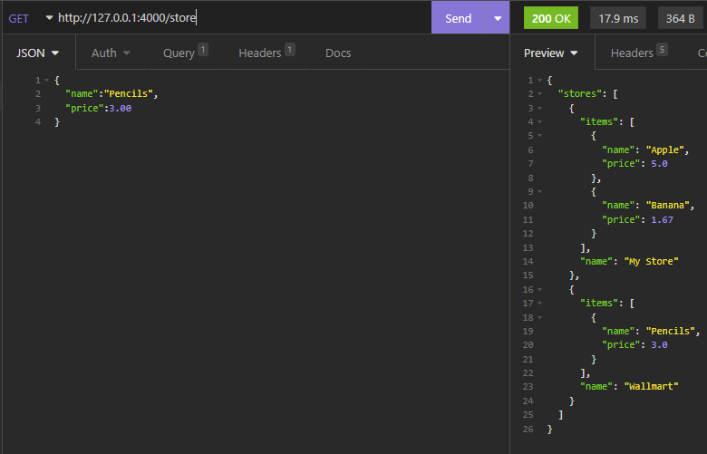

# API REST
Es una interfaz de programación que se ajuste a los límites de la aquitectura Rest
y permite una interracción con los servicios web RESTFul

Las **API** son un conjunto de instrucciones y protocolos que se utilizan para diseñar
e integrar las aplicaciones de software. Son las que permiten la comunicación
entre servidor y usuario, ya que siempre estamos haciendo uso de diferentes métodos
para recibir, enviar, modificar o eliminar información de la web. Esto se hace
gracias a que los formularios están estructurados de una forma que envian información 
en formato JSON, el cual es recibido por la base de datos y de ahí ya dependiendo
del servicio web que se requiera se hace el procesamiento de datos necesarios.

En pocas palabras las API son la intermediarias de los servicios que usamos en
internet ya que transportan toda la información nesesaria para que la aplicación
funcione.

#Creación de una API Rest en Python con Flask
Lo primero que deberiamos de tener en cuenta es que necesitamos de una base de
datos para poder ejecutar una API, en este caso vamos a crear un diccionario que
al final termina funcionando de la misma forma, por lo que se puede hacer de la
forma que más nos resulte óptima para practicar.

    stores = [
        {
            "name": "My Store",
            "items": [
                {
                    "name": "Apple",
                    "price": 5.00
                },{
                    "name":"Banana",
                    "price":1.67
                }
            ]
        }
    ]

Ahora con nuestra base de datos procedemos a crear nuestro endpoint, que es
desde donde se conectara la API para obtener la información.

    @app.get("/store")
    def get_stores():
        return {"stores": stores}

Con el anterior bloque de código obtenemos la información del diccionario y lo
pasamos a un formato JSON para que el navegador nos lo mustre correctamente, solo
tenemos que ingresar la dirección del servidor local en el que este corriendo
nuestro entorno virtual y le añadimos el enpoint que creamos. Por defecto Flask
se ejecutará en el puerto 5000, pero aquí con este código hicimos que se
ejecutará en 4000 y activamos las opciones de desarollador.
    
    if __name__ == '__main__':
        app.run(debug=True, port=4000)

Nos tiene que quedar algo como la siguiente imagen para ver la consulta de la
API.

Ahora vamos a crear a hacer que con el mismo endpoint podamos crear otra tienda

    @app.post("/store")
    def create_store():
        request_data = request.get_json()
        new_store = {"name": request_data["name"], "items": []}
        stores.append(new_store)
        return new_store, 201

Con esto hacemos que desde un formulario o un cliente API insertemos la información,
es decir que podemos hacer un post en este mismo endpoint, solo que hay que insertar 
los datos en formato JSON, quedando algo así.

Ahora vamos a hacer que se puedan crear articulos para la nueva tienda que creamos,
para eso creamos un nuevo endpoint que contenga el nombre de la tienda que se creó,
eso lo logramos escribiendolo de la siguiente manera
    
    @app.post("/store/<string:name>/item")
    def create_item(name):
        request_data = request.get_json()
        for store in stores:
            if store["name"] == name:
                new_item = {"name": request_data["name"], "price": request_data["price"]}
                store["items"].append(new_item)
                return new_item, 201
        return {"message": "Store not found"}, 404
    
Así cuando en la URL insertemos el nombre de la tienda que creamos con el slash de item e insertamos el formato JSON correspondiente terminaremos de llenar los articulos que tiene el esta tienda.

Ahora vamos a crear el endpoint con el método GET para ver solo los articulos de la tienda que creamos con anterioridad

    @app.get("/store/<string:name>")
    def get_store(name):
        for store in stores:
            if store["name"] == name:
                return store
        return {"message": "Store not found"}, 404

Ahora si insertamos la URL anterior con el método GET nos arrojara toda la
información que contenga la llave con el nombre de la tienda.

Y ahora vamos a crear la URL que nos muestre los solo los articulos de la tienda a la
que le especifiquemos de la siguiente forma:

    @app.get("/store/<string:name>/item")
    def get_item_in_store(name):
        for store in stores:
            if store["name"] == name:
                return {"items": store["items"]}
        return {"message": "Store not found"}, 404

Lo que nos permitira hacer un GET con solo los articulos, omitiendo en el resultado
el nombre de la tienda a la cual pertenecen los articulos.

**Aclaración**

Los errores que retorna si hay un error en la obtención de algún dato o su respectiva
creación nos ayudan a saber en que parte está fallando el código y es de buena
práctica ponerlo, además de que resulta útil a la hora de hacer testeos.